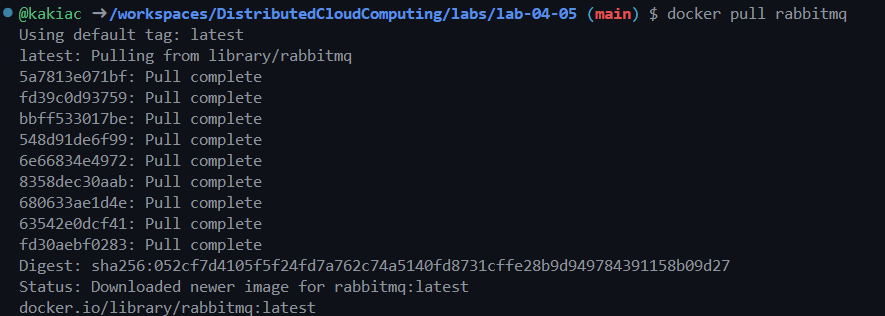
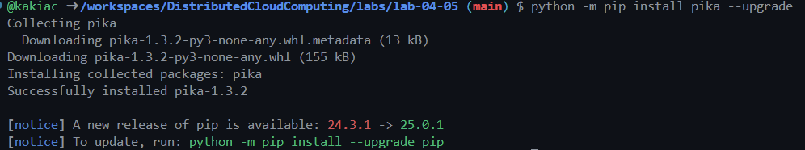

## 🟡🧪 Lab 04.05: RabbitMQ Tutorial 
Distributed Cloud Computing / Distributed Systems ⏺️ Last updated: Feb 2025, Dr Kakia Chatsiou

### About RabbitMQ

#### Lab Overview

#### Before you get started (Lab Prerequisites)

docker pull rabbitmq

You should be seeing something like this



Then run the docker.

$ docker run -d --hostname my-rabbit --name some-rabbit rabbitmq:3

docker run -it --rm --name test1 -p 5672:5672 -p 15672:15672 -p 25672:25672 rabbitmq:3-management


``` python

python -m pip install pika --upgrade

```


#### Tasks

#### Files